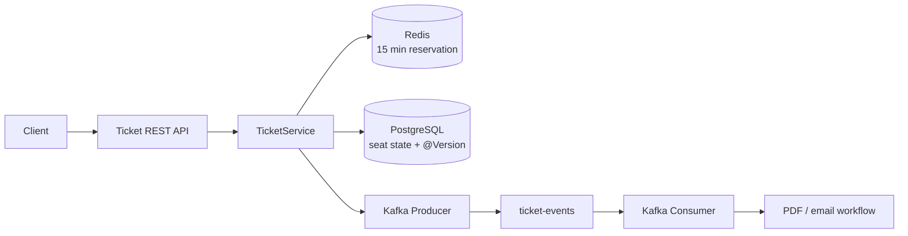

# Smart Ticket Platform

<p align="center">
  
  
  
  
  
</p>

**High-load ticketing learning backend built around temporary reservations, optimistic locking, and event-driven purchase processing.**

The project models one of the hardest ticketing problems: many users competing for the same seat while slow follow-up work should not block the purchase request.

## High-load building blocks

- **Redis TTL reservation** — a seat can be held temporarily for 15 minutes.
- **Optimistic locking** — the `Seat` entity uses JPA `@Version` to detect conflicting updates.
- **Kafka events** — successful purchases publish keyed `ticket-events`.
- **Async processing** — a Kafka consumer handles the slow post-purchase flow separately from the HTTP request.
- **PostgreSQL + Flyway** — versioned relational schema for events, seats, and orders.
- **Docker Compose** — local Redis and Kafka infrastructure.
- **OpenAPI / Swagger** — API exploration through Springdoc.

## Architecture



## Main endpoints

```text
POST /api/v1/tickets/reserve/{seatId}
POST /api/v1/tickets/buy/{seatId}
```

## Run locally

Start Redis and Kafka:

```bash
docker compose up -d
```

Make sure PostgreSQL is available at `localhost:5432` with database `ticket_db`, then run:

```bash
./gradlew bootRun
```

Swagger UI: `http://localhost:8080/swagger-ui.html`

> This repository is a learning prototype for high-load and event-driven patterns. The current Kafka consumer simulates PDF generation and email delivery rather than integrating real external services.
